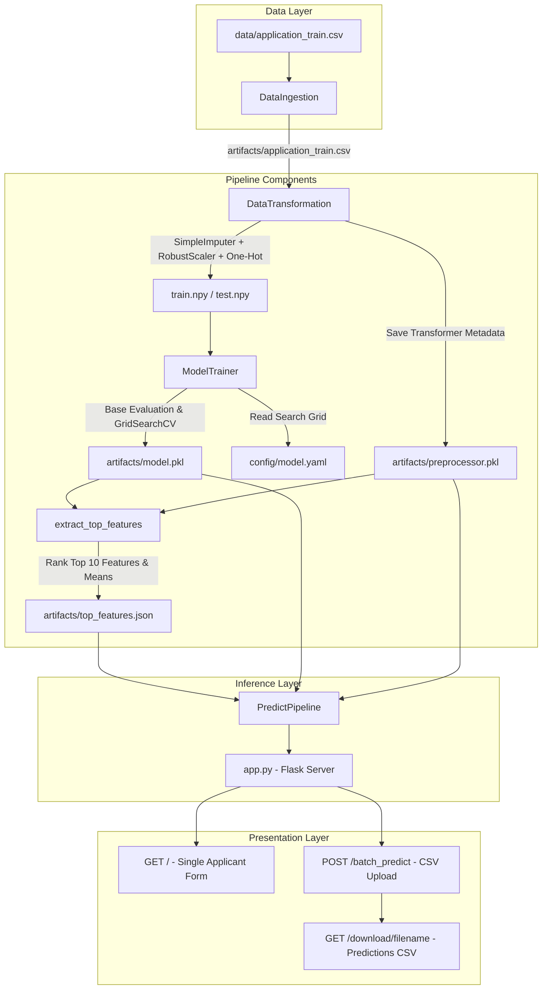

# Loan Risk Predictor (Home Credit Default Risk Prediction)

[](https://www.python.org/)
[](https://flask.palletsprojects.com/)
[](https://scikit-learn.org/)
[](https://xgboost.readthedocs.io/)
[](LICENSE)

An end-to-end Machine Learning pipeline and web application designed to evaluate loan applicant default risk using the Home Credit dataset. The repository includes modular data ingestion, automated feature preprocessing, hyperparameter-tuned model training (XGBoost, Random Forest, Gradient Boosting), feature importance ranking, real-time single applicant web evaluation, and bulk CSV batch prediction capabilities.

---

## Table of Contents

- [System Architecture](#system-architecture)
- [Key Features](#key-features)
- [Repository Structure](#repository-structure)
- [Machine Learning Pipeline Details](#machine-learning-pipeline-details)
  - [1. Data Ingestion](#1-data-ingestion)
  - [2. Data Transformation \& Preprocessing](#2-data-transformation--preprocessing)
  - [3. Model Training \& Hyperparameter Tuning](#3-model-training--hyperparameter-tuning)
  - [4. Top Feature Extraction](#4-top-feature-extraction)
  - [5. Prediction Pipeline](#5-prediction-pipeline)
- [Web Application \& Endpoints](#web-application--endpoints)
- [Installation \& Setup](#installation--setup)
- [Usage Guide](#usage-guide)
  - [Running the Training Pipeline](#running-the-training-pipeline)
  - [Starting the Web Server](#starting-the-web-server)
  - [Running Tests](#running-tests)
- [Configuration \& Artifact Management](#configuration--artifact-management)

---

## System Architecture

The project follows a decoupled software architecture, separating data processing, model engineering, inference pipelines, and presentation layers:



---

## Key Features

- **Modular Pipeline Design**: Object-oriented pipeline design with dedicated components for ingestion, transformation, model evaluation, and inference.
- **Robust Preprocessing**: Integrates `SimpleImputer` (median strategy) for missing value handling, `RobustScaler` for numerical feature scaling, and dummy variable alignment for categorical features.
- **Automated Model Selection**: Benchmarks `XGBClassifier`, `GradientBoostingClassifier`, and `RandomForestClassifier`. Performs 3-fold cross-validation `GridSearchCV` on the best base candidate.
- **Top 10 Feature Ranking**: Identifies tree-based feature importances and extracts the top 10 most decisive parameters (`EXT_SOURCE_3`, `DAYS_REGISTRATION`, `DAYS_ID_PUBLISH`, etc.) for lightweight form inputs.
- **Dual Inference Modes**:
  - **Single Applicant Web Form**: Evaluates real-time risk scores based on top feature inputs with fallback default imputations for missing fields.
  - **Batch Inference**: Processes bulk CSV files, maps model outputs to human-readable target labels (`0: 'bad'`, `1: 'good'`), and provides downloadable result files.
- **Production Utilities**: Includes centralized logging (`src/logger.py`), custom error line tracing (`src/exception.py`), and helper utility wrappers (`src/utils/main_utils.py`).

---

## Repository Structure

```text
loan-risk-predictor/
├── app.py                         # Flask Web Application entry point
├── requirements.txt               # Project dependencies
├── config/
│   └── model.yaml                 # Hyperparameter search grid definitions for models
├── data/
│   ├── application_train.csv      # Raw training dataset
│   └── application_test.csv       # Raw test dataset
├── artifacts/                     # Generated artifacts directory
│   ├── model.pkl                  # Serialized best trained model object
│   ├── preprocessor.pkl           # Saved preprocessor metadata & feature defaults
│   └── top_features.json          # Cached top 10 feature names & baseline means
├── src/
│   ├── __init__.py
│   ├── exception.py               # Custom Exception class with detailed traceback formatting
│   ├── logger.py                  # File logging setup with timestamped logs
│   ├── constant/
│   │   └── __init__.py            # Path constants and target column definition
│   ├── components/
│   │   ├── __init__.py
│   │   ├── data_ingestion.py      # Data Ingestion component
│   │   ├── data_transformation.py # Data Transformation & Preprocessing component
│   │   └── model_trainer.py       # Model evaluation & GridSearchCV tuning component
│   ├── pipeline/
│   │   ├── __init__.py
│   │   ├── train_pipeline.py      # End-to-end training pipeline orchestrator
│   │   └── predict_pipeline.py    # Batch and real-time prediction pipeline
│   └── utils/
│       ├── __init__.py
│       ├── main_utils.py          # YAML parsing, object serialization (pickle)
│       └── extract_top_features.py# Feature importance ranking & JSON exporter
├── templates/
│   ├── form.html                  # Single applicant interactive prediction form template
│   └── upload.html                # Batch CSV upload template
├── tests/
│   ├── test_data_ingestion.py     # Data ingestion component test
│   ├── test_data_transformation.py# Data transformation component test
│   ├── test_model_trainer.py      # Model trainer component test
│   ├── test_extract_top_features.py# Top feature extraction test
│   ├── test_predict_pipeline.py   # Prediction pipeline integration test
│   └── test_train_pipeline.py     # Training pipeline integration test
└── notebooks/
    └── Home_Credit.ipynb          # Exploratory Data Analysis & experiments notebook
```

---

## Machine Learning Pipeline Details

### 1. Data Ingestion
- **Module**: `src/components/data_ingestion.py`
- Reads raw training data from `data/application_train.csv`.
- Creates the target artifacts directory and persists a clean working copy to `artifacts/application_train.csv`.

### 2. Data Transformation & Preprocessing
- **Module**: `src/components/data_transformation.py`
- Drops identifiers (`SK_ID_CURR`).
- Splits dataset into 70% Training and 30% Testing sets (`random_state=42`).
- Applies numerical transformation pipeline: `SimpleImputer(strategy='median')` followed by `RobustScaler()`.
- Encodes categorical fields via `pd.get_dummies(drop_first=True)` and aligns column indices across test/train matrices.
- Serializes `preprocessor.pkl` containing numeric pipelines, default feature means, and categorical schema references.

### 3. Model Training & Hyperparameter Tuning
- **Module**: `src/components/model_trainer.py`
- Reads hyperparameter search grids from `config/model.yaml`.
- Evaluates initial baseline accuracy across candidate classifiers (`XGBClassifier`, `GradientBoostingClassifier`, `RandomForestClassifier`).
- Fine-tunes the top candidate using `GridSearchCV(cv=3)`.
- Validates model output against performance threshold (`expected_accuracy = 0.45`).
- Persists the final tuned model to `artifacts/model.pkl`.

### 4. Top Feature Extraction
- **Module**: `src/utils/extract_top_features.py`
- Reads `model.pkl` and `preprocessor.pkl` to rank global feature importances (`model.feature_importances_`).
- Filters the top 10 features with their corresponding baseline averages from `train_processed.csv`.
- Generates `artifacts/top_features.json` to dynamically build input fields in the user interface.

Current Top 10 Features:
1. `EXT_SOURCE_3`
2. `DAYS_REGISTRATION`
3. `DAYS_ID_PUBLISH`
4. `EXT_SOURCE_1`
5. `REGION_POPULATION_RELATIVE`
6. `DAYS_BIRTH`
7. `EXT_SOURCE_2`
8. `LIVINGAREA_AVG`
9. `DAYS_LAST_PHONE_CHANGE`
10. `AMT_INCOME_TOTAL`

### 5. Prediction Pipeline
- **Module**: `src/pipeline/predict_pipeline.py`
- Reconstructs full feature vectors for incomplete inputs by filling unprovided fields with stored training distribution statistics (`feature_means`).
- `predict_from_dict()`: Transforms single input dictionary into numerical matrix and outputs raw class predictions.
- `predict_from_csv()`: Reads batch CSV, transforms full matrix, maps predicted labels (`0: 'bad'`, `1: 'good'`), and exports output CSV file to `artifacts/predictions/prediction_file.csv`.

---

## Web Application & Endpoints

The Flask application (`app.py`) provides web interfaces for single applicant evaluations and bulk file processing:

| Endpoint | HTTP Method | Functionality |
| :--- | :--- | :--- |
| `/` | `GET` / `POST` | Renders dynamic form for top 10 features (`form.html`) and displays real-time prediction (`0` or `1`). |
| `/batch_predict` | `GET` / `POST` | Renders file upload page (`upload.html`) for batch CSV file processing. |
| `/download/<filename>` | `GET` | Downloads generated batch prediction CSV files from `artifacts/predictions/`. |

---

## Installation & Setup

### Prerequisites
- Python 3.9+ (Python 3.10/3.11 recommended)
- Git

### Environment Setup

1. **Clone the Repository**:
   ```bash
   git clone https://github.com/ydv-prince/loan-risk-predictor.git
   cd loan-risk-predictor
   ```

2. **Create and Activate Virtual Environment**:
   - **Windows**:
     ```bash
     python -m venv venv
     .\venv\Scripts\activate
     ```
   - **Linux / macOS**:
     ```bash
     python3 -m venv venv
     source venv/bin/activate
     ```

3. **Install Dependencies**:
   ```bash
   pip install -r requirements.txt
   ```

---

## Usage Guide

### Running the Training Pipeline

To execute data ingestion, transformation, model evaluation/tuning, and feature extraction:

```bash
python src/pipeline/train_pipeline.py
```

*Note: Training pipeline uses a 1,000 sample slice during `ModelTrainer` execution for optimized local execution.*

### Starting the Web Server

Launch the Flask development server:

```bash
python app.py
```

Access the interface in your browser at:
`http://127.0.0.1:5000`

### Running Tests

Execute component and integration test scripts located in `tests/`:

```bash
# Test Data Ingestion
python tests/test_data_ingestion.py

# Test Data Transformation
python tests/test_data_transformation.py

# Test Model Trainer
python tests/test_model_trainer.py

# Test Top Feature Extractor
python tests/test_extract_top_features.py

# Test Batch Predict Pipeline
python tests/test_predict_pipeline.py

# Test End-to-End Training Pipeline
python tests/test_train_pipeline.py
```

---

## Configuration & Artifact Management

### Model Configuration (`config/model.yaml`)

Hyperparameters for candidate models can be customized in `config/model.yaml`:

```yaml
model_selection:
  model:
    XGBClassifier:
      search_param_grid:
        max_depth: [5, 7]
        n_estimators: [10, 20]
    GradientBoostingClassifier:
      search_param_grid:
        n_estimators: [100]
        criterion: ['friedman_mse']
    RandomForestClassifier:
      search_param_grid:
        n_estimators: [100, 200]
        max_depth: [5, 10]
        min_samples_split: [2]
        min_samples_leaf: [1]
```

### Artifact Directory Structure (`artifacts/`)

Artifacts created during ingestion, transformation, training, and inference are stored in `artifacts/`:

- `model.pkl`: Serialized final tuned machine learning model.
- `preprocessor.pkl`: Pickled dictionary containing numerical transformer pipelines and dataset metadata.
- `top_features.json`: Top 10 feature names and training set default means.
- `predictions/`: Destination directory for batch prediction output CSV files.
- `prediction_artifacts/`: Temporary directory for uploaded batch CSV files.

---

## License

Distributed under the MIT License. See `LICENSE` for more details.
